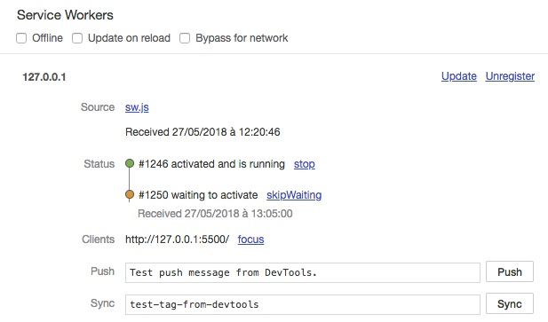

# Step 2 : Install a Service Worker

Before delving into service workers, let's first understand what are web workers.

## Introduction to Web workers

As you may know, JavaScript is single threaded and does not allow the creation of threads.
A web worker allows to execute code in a separate thread for general use.
The code of the web worker generally resides in a separate JavaScript file that is loaded form the main JavaScript code.
After creating the web worker, we have two JavaScript threads: the main JavaScript thread and the worker thread.
Once the web worker is created, it can interact with the main JavaScript in a two-way fashion by using the postMessage function.

Since the web worker has its own thread, it can perform process-heavy tasks without freezing the page.

Here is a minimal web page that created a service worker and communicates with it.

```html
<!DOCTYPE html>
<html>
<head>
    <meta charset="UTF-8">
    <script src="main.js"></script>
    <title>Web worker example</title>
</head>
<body>
    <button onclick="sendMessageToWorker()">Post message to worker</button>
    <button onclick="askWorkerToPerformRecurringTask()">Launch recurring task</button>
    <h3>Worker result</h3>
    <div id="result"></div>
</body>
</html>
```

Here is the code of the main JavaScript that creates the worker and sends / receives  messages to / from it.

```javascript
// crate a worker whose code is defined in the file passed as parameter 
const worker = new Worker("worker.js");
function askWorkerToPerformRecurringTask(){
    // post a sting to the worker
    worker.postMessage("recurring");
}
function sendMessageToWorker(){
    // post a sting to the worker
    worker.postMessage("Hello World !");
}
// This event is fired when the worker posts a message
// The value of the message is in messageEvent.data
worker.addEventListener("message", function(messageEvent){
    const div = document.getElementById("result");
    // Log the received message on the top of the tag
    div.innerHTML = messageEvent.data + "<br>" + div.innerHTML;
});
```

Finally, here is the code of the web worker that reacts to the message recieved from the main JS by either posting back a single message or by posting a random number each second.

```javascript
// a function that generates a random number every second and posts it to the main JavaScript
function generateNumbers(){
    setInterval(function(){
        // post a message to the main JavaScript
        self.postMessage(Math.random());
    }, 1000);
}
// This event is fired when the worker recieves a message from the main JavaScript
// The value of the message is in messageEvent.data
self.addEventListener("message", function(messageEvent){
    if(messageEvent.data === "recurring"){
        // If the value of the event is "recurring", we launch the above function
        generateNumbers();
    }else{
        // Post a message back to the main JS
        self.postMessage("Hello to you too !");
    }
});
```

This concludes this simple introduction to web workers. We can play with service workers next.

## Service workers

A [Service Worker](https://developers.google.com/web/fundamentals/primers/service-workers/) is a type of web worker that serve as a proxy between the browser and the network.
It has a fairly large API with a lot of potential.
In the context of a PWA, a Service Worker will mainly allow us to define a caching strategy and thus better manage unstable connections, or even get a complete offline mode for our application.

What you should know about Service Workers:

* They are workers coded in JavaScript. They run in their own thread, separated from the application, and can not access the DOM or global variables. But the app and worker can communicate through the `postMessage` API.
* These can act like programmable network proxies: they can intercept network requests from the browser and customize the responses.
* Their life cycle is independent of the associated web application: they automatically stop when not in use and restart when needed.
* They can work even when the associated web application is not running, allowing some new features like sending push notifications.
* Several APIs are available within the Service Worker to persist data locally, for example the [**Cache API**](https://developer.mozilla.org/en/docs/Web/API/Cache) and the [**IndexedDB API**](https://developer.mozilla.org/en/docs/Web/API/API_IndexedDB).
* Most of the associated APIs use [Promises](https://developer.mozilla.org/en/docs/Web/JavaScript/Reference/Global_Objects/Promise).

In the `app` folder, create a new `sw.js` file. It will contain the code of your Service Worker.

## Registering the Service Worker

Before using a Service Worker, it must be registered by the application. The Service Worker is usually registered when the page is loaded. In the `scripts.js` file, complete the function called when the document is loaded with the following code:

```js
if ('serviceWorker' in navigator) {
  navigator.serviceWorker
    .register('/sw.js')
    .then(serviceWorker => {
      console.log('Service Worker registered: ' + serviceWorker);
    })
    .catch(error => {
      console.log('Error registering the Service Worker: ' + error);
    });
}
```

Reload the page, the following log should appear in the console once the page loaded.

```Access log
Service Worker registered: [object ServiceWorkerRegistration]
```

This means that the Service Worker has been registered. This can be verified by looking in the **Application** tab of Chrome Dev Tools, then the **Service Workers** subsection.


We will see in the following section what happens after registering a Service Worker.

## Service Worker life cycle

When you register a Service Worker, its life cycle starts. The following diagram shows the different stages of a Service Worker's life cycle ([source](https://developers.google.com/web/fundamentals/primers/service-workers/)).


The first steps are installation and activation. Let's check this by adding the following code in the _sw.js_ file.

```js
self.addEventListener('install', event => {
  console.log('Service Worker installing.');
});

self.addEventListener('activate', event => {
  console.log('Service Worker activating.');
});
```

Reload the page and check the logs. Curiously, we only see the installation log.

```
Service Worker registered [object ServiceWorkerRegistration]
Service Worker installing.
```

Let's check what is going on in the Service Worker section of the Dev Tools. You should see something like this:



When you refresh the page, the browser tries to install and activate the Service Worker with the new code. Since the latter is different from the active Service Worker, the one that has been registered at the beginning of step 2, the activation of the new one is suspended. In this case, it is put in a waiting mode and will only be installed if the previous Service Worker does not control any clients. There are two solutions in this case: either close all the tabs controlled by the first Service Worker, or click on the **skipWaiting** link in the dev tools.

Click on the **skipWaiting** link. Notice that the former Service Worker has disappeared and that the one who was waiting took his place. The activation log is also displayed in the console.

```
Service Worker activating.
```

When we refresh the page without modifying the Service Worker, we notice that we no longer go through the installation and activation steps.

This behavior is necessary to manage version upgrades in production. In practice, you will write code in the Service Worker that manages this update process and call `skipWaiting` programmatically once everything is set up correctly.

During development, we will keep things simple by ticking the checkbox **Update on reload**. This option will immediately activate future new Service Workers. It's an equivalent of an automatic click on **skipWaiting** each time.

::: tip Note
Enable the **Update on reload** option when working on the code of a Service Worker to always have the latest version. 


However, this option will install and activate the Service Worker **before** displaying the page, so you won't see the logs associated with these events in console.
:::

## PWA compatibility library

Progressive Web Apps is a new and evolving technology.
Some browsers do not support yet some PWA features. For example, there is not splash-screen support in mobile Safari 12.
[pwacomat](https://github.com/GoogleChromeLabs/pwacompat) from Google Chrome Labs fixes this by simply adding a script tag in the html file.

```html
<script async src="https://cdn.jsdelivr.net/npm/pwacompat@2.0.8/pwacompat.min.js"
    integrity="sha384-uONtBTCBzHKF84F6XvyC8S0gL8HTkAPeCyBNvfLfsqHh+Kd6s/kaS4BdmNQ5ktp1"
    crossorigin="anonymous"></script>
```

We strongly recommend to add this script for your PWAs for better compatibility.

## Local development with SSL

PWA requires HTTPS fully function. This not a big matter for a deployed PWA because most web hosts provide HTTPS out of the box. However, it is not the case for local development. In fact, it requires manually generating and installing certificates to the certificate store. Fortunately, there is a cool CLI tool called [mkcert](https://mkcert.dev/) that simplifies these steps.

Let's setup our local HTTPS server by following these steps:

* Install [mkcert](https://github.com/FiloSottile/mkcert#installation) as indicated in its GitHub page
* Run `mkcert -install` to install a local CA (Certification authority)

```console
Created a new local CA at "/Users/****/Library/Application Support/mkcert" 💥
The local CA is now installed in the system trust store! ⚡️
The local CA is now installed in the Firefox trust store (requires browser restart)! 🦊
```

* cd to the website root
* Run this command that generated certificated for our server: `mkcert localhost 127.0.0.1`

```console
Using the local CA at "/Users/****yassinebenabbas****/Library/Application Support/mkcert" ✨

Created a new certificate valid for the following names 📜
 - "localhost"
 - "127.0.0.1"
 - "::1"

The certificate is at "./localhost+2.pem" and the key at "./localhost+2-key.pem" ✅
```

* We will get two pem files. These will be used by our SSL enabled dev server.


* Install npm package `http-server`
* Run the server in SSL mode `http-server -S -o -C "localhost+2.pem" -K "localhost+2-key.pem"`


In this part, we saw how to install a Service Worker, and how to manage two Service Worker lifecycle events: **install** and **activate**. Now, let's see how to do something useful with this Service Worker.