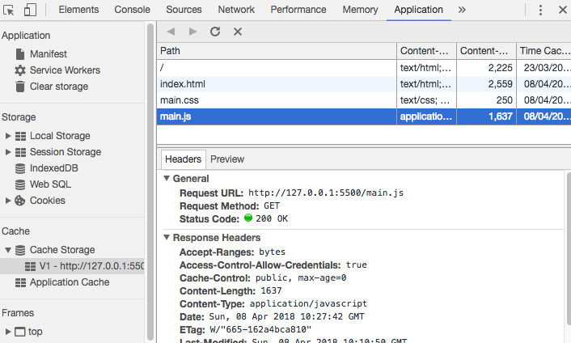
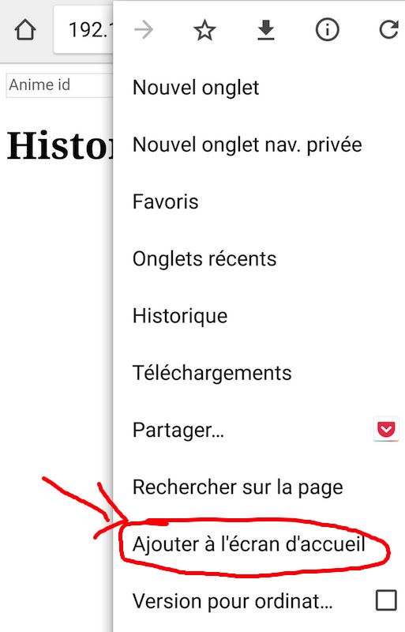
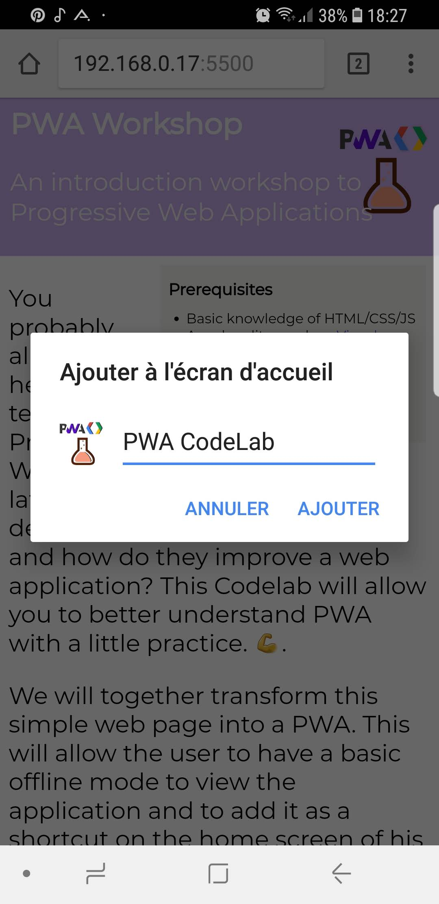
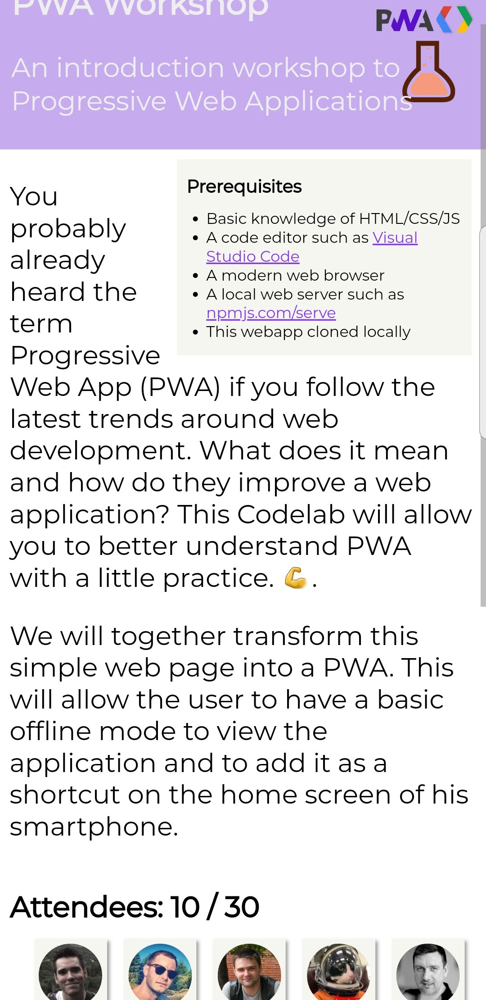

# Step 3: Precaching static assets for a basic offline mode

We saw in the previous step two methods of the Service Worker life cycle: `install` and` activate`. In this part, we will continue our exploration of PWA by caching static files.

## Overview of promises and async/await

Service worker APIs rely heavily on promises. Let's take a quick look on how they work.

_You can try the code in this section using node or an online editor such as [https://repl.it](https://repl.it/languages/nodejs)_

Promises provide a way to transform an asynchronous function to an object which allows us to react when the function completes.
The ES2015 allows to create promises using this constructor:

```javascript
const promise = new Promise((resolve, reject) => {
  // async function execution
  // resolve is called on success
  // reject is called on failure
});
```

We will not use this kind of constructor however because the Service worker APIs provide functions that return a promise, as illustrated by the following example:

```javascript
function someAsyncServiceWorlerFunction(){
  return new Promise((resolve, reject) => {
  // async function execution
  // resolve is called on success
  // reject is called on failure
  });
}
const promise = someAsyncServiceWorlerFunction();
```

Here is a more concrete example of a promise that generates a random number after a 1 second delay. It succeeds when the generated number is even and fails when the generated number is odd.

```javascript
function generateRandomNumber() {
    return new Promise(function(resolve, reject) {
        setTimeout(function () {
            const nb = Math.floor(Math.random() * 10); // random number between 0 and 10
            if (nb % 2 == 0) {
                resolve(nb);
            } else {
                reject({message:"odd number", number: nb});
            }
        }, 1000);
    });
}
```

Once we create a promise object, it starts to execute asynchronously. We can use the `then()` and `reject()` functions to execute a function when the promises succeeds (it calls `resolve`) or fails (it calls `reject`).

The following example illustrates how to handle the promise returned by the `generateRandomNumber()` function. [Run online](https://repl.it/@yostane/promise01)

```javascript
const promise = generateRandomNumber(); // create a promise that generated a random number asynchronously
promise.then(function (number) { // this function is called when the promise succeds
    console.log(number);
}).catch(function (error) { // this function is called when the promise fails
    console.error(error);
});
console.log("Promise example"); // this message is shows first because the promise is async
```

We can abbreviate the promise call by extracting the `then` and `catch` handlers as functions. [Run online](https://repl.it/@yostane/promise02)

```javascript
function handleSuccess(number) {
    console.log(number);
}
function handleFailure(message) {
    console.error(message);
}
generateRandomNumber().then(handleSuccess).catch(handleFailure);
console.log("Promise example"); // this message is shows first because the promise is async
```

Promises can be easily chained. The following example generates a new random number asynchronously after the first one has been generated and printed. [Run online](https://repl.it/@yostane/promise03)

```javascript
function handleSuccess(number) {
    console.log(number);
}
function handleFailure(message) {
    console.error(message);
}
generateRandomNumber().then(handleSuccess)
  .then(generateRandomNumber).then(handleSuccess) // chain a second promise and handle is result
  .catch(handleFailure); // if any of the previous calls fails, catch is called
console.log("Promise example"); // this message is shows first because the promise is async
```

There is alternative way for calling and chaining promises. Instead of calling the `then` function and pass it another function that processes the result. We can retrieve the result when it becomes is available without passing function. This is called awaiting the result and uses the `async/await` keywords. With this method, the catch method is replaced by a `try/catch` block.

The following code snippet transforms the last example to use `async/await`. [Run online](https://repl.it/@yostane/promise04)

```javascript
// If we want to use await, we must be place the code in async function
// More reading https://github.com/tc39/proposal-top-level-await, https://gist.github.com/Rich-Harris/0b6f317657f5167663b493c722647221
async function mainAsync(){
    try{
        const nb1 = await generateRandomNumberAsync(); // create the promise and wait for its result (the parameter passed to resolve) asynchrnously without blocking the javascirpt thread
        console.log(nb1); // nb1 is not the promise but rather its result in case of success (the parameter passed to resolve)
        const nb2 = await generateRandomNumberAsync(); // create the promise and wait for its result (the parameter passed to resolve) asynchrnously without blocking the javascirpt thread
        console.log(nb2);
    }catch(error){ // this catch block is executed if any promise fails
        console.error(error); // The error object is the value passed to reject
    }
}
mainAsync(); // call the function that runs async code
console.log("Promise example with async / await");
```

This concludes this overview about promises and async/await.
With this knowledge acquired, we can use the caching APIs of the service worker more serenely.

*If you still feel uncomfortable with promises, here are some exercices: [set 1](https://github.com/asakusuma/promise-workshop), [set 2](https://repl.it/@AdamCahan/Promise-practice-exercises), [set 3](https://developers.google.com/web/ilt/pwa/lab-promises)*

## Exploring caching APIs

Of the [APIs that the Service Worker has access to](https://developer.mozilla.org/en-US/docs/Web/API/Service_Worker_API), the one we are interested in is [Cache API](https://developer.mozilla.org/en-US/docs/Web/API/Cache). Indeed, it makes it possible to put in a persistent cache the requests/responses pairs with the method `cache.put(request, response)`. It is also possible to pass one or more URLs as arguments to the `cache.add` and `cache.addAll` methods; they will be requested and the network response will be added to the cache. You can also delete cache entries with the `cache.delete` method.

The different caches are accessible through the `caches` variable from the Service Worker. It is the [CacheStorage API](https://developer.mozilla.org/en-US/docs/Web/API/CacheStorage) which allows, among other things, to create / retrieve a cache object or to delete one with the `caches.open` and `caches.delete` functions.

Finally, another interesting method of the cache is `match`: it checks in all `Cache` objects managed by the `CacheStorage` if a request is identical to that passed in parameter. If so, it returns a Promise resolved with the cached response.

## Adding static files to the cache

We will cache the essential static files of the application as soon as possible. The best timing to do this is when the `install` event is triggered, because it is only called once at Service Worker installation. This is called *precaching*.

1. Go to `sw.js` in the `install` event callback as seen in step 2.
2. Open the cache with [`caches.open('V1')`](https://developer.mozilla.org/en-US/docs/Web/API/CacheStorage/open), which returns a Promise resolved with the `cache` object. The version number in the cache name will be useful for future updates.
3. Once the cache is open, add to the cache with [`cache.addAll(['url1', 'url2', ...])`](https://developer.mozilla.org/en-US/docs/Web/API/Cache/addAll). the URLs to the essential static files of our application: the root HTML page, the `styles.css` file and the` scripts.js` file.
4. In order for the Service Worker to activate after precaching is complete, pass the `Promise` returned by `cache.addAll` as an argument to [`event.waitUntil ()`](https://developer.mozilla.org/en-US/docs/Web/API/ExtendableEvent/waitUntil), `event` being the installation event.

<Solution>

```js
const CACHE_NAME = 'V1';
const STATIC_CACHE_URLS = ['/', 'styles.css', 'scripts.js'];

self.addEventListener('install', event => {
  console.log('Service Worker installing.');
  event.waitUntil(
    caches.open(CACHE_NAME)
    .then(cache => cache.addAll(STATIC_CACHE_URLS))  
  )
});
```

</Solution>

Reload the page and the Service Worker, making sure that the new version of the Service Worker replaces the old one as seen in step 2. We can then check that the files are added to the cache by looking at the *Cache Storage section* in the *Application* tab of Chrome Developer Tools.



## Response with cache in priority

Now that the files are cached, we have to indicate to use their cached version when the browser requests them. To do this, we will use the `fetch` event. The latter intercepts all requests made by clients who have installed the Service Worker. You can then return a custom response with `event.respondWith`, where `event` is the [FetchEvent](https://developer.mozilla.org/en-US/docs/Web/API/FetchEvent). The [`event.respondWith`](https://developer.mozilla.org/en-US/docs/Web/API/FetchEvent/respondWith) function takes as a single argument a Promise that must be resolved with the response to return.

```js
self.addEventListener('fetch', event => {
	console.log(`Request of ${event.request.url}`);

	// default behaviour: request the network
	event.respondWith( fetch(event.request) );
})
```

We want to change the default behavior and return previously cached versions if they exist. Precisely, the [`caches.match`](https://developer.mozilla.org/en-US/docs/Web/API/CacheStorage/match) function returns a Promise resolved with a` Response` object, just like `fetch (event.request)`. So we can replace one by the other and return the static files from cache instead of requesting them from the network.

1. Add a callback for the `fetch` event, the same way you did for` install` in the previous step.
2. Call the `caches.match(event.request)` method to search the cache for a cached response for the corresponding request.
3. If no cache entry is found, the Promise is resolved with the value `undefined`. In this case, you need to request the network and return `fetch(event.request)` instead.
4. Finally, return this Promise of Response to the client request by passing it as argument to `event.respondWith()`

<Solution>
```js
self.addEventListener('fetch', event => {
  // Cache-First Strategy
  event.respondWith(
    caches.match(event.request) // check if the request has already been cached
    .then(cached => cached || fetch(event.request)) // otherwise request network
  );
});
```
</Solution>

## Testing offline

If everything has been done correctly, you should now be able to test the application in offline mode. Shut down your local server and try to reload the application. The cached page should be displayed.

## Update the static cache

Caching static files raises a question: what happens if I add, delete, or modify these files on the server ?

As we have currently coded our Service Worker, we will always load the cached files, so new versions deployed on the server will never be used.

To handle this problem, one solution is to use a new cache with another name. The idea here would be to create a new **V2** cache that contains the new files and remove the previous obsolete cache.

1. In the `install` event callback, change the cache name to` V2`
2. In the `activate` event callback, delete the old cache with `caches.delete('V1')`
3. Pass the `Promise` returned by` caches.delete` in `event.waitUntil` in order to wait for the cache to be removed before the end of the activation step
4. *(optional)* - Improve your cache cleanup code by removing all caches that are not in your whitelist of used caches. You can browse all existing caches with the `caches.keys()` method

<Solution>
```js
const CACHE_NAME = 'V2';

self.addEventListener('activate', event => {
  // delete any unexpected caches
  event.waitUntil(
    caches.keys()
    .then(keys => keys.filter(key => key !== CACHE_NAME))
    .then(keys => Promise.all(keys.map(key => {
        console.log(`Deleting cache ${key}`);
        return caches.delete(key)
    })))
  );
});
```
</Solution>


## Installing the PWA

Depending on the browser and OS, the technical requirements to install the PWA on the system may vary. But in theory, if you have a manifest and an active Service Worker handling incoming requests with `fetch`, then you should be able to install that PWA on all supported platforms, and they will leverage the manifest and Service Worker.

The installation of PWA is supported on Chrome OS but still experimental on other systems with Chrome. You can enable the installation of PWA with Chrome by enabling this flag: **chrome://flags/#enable-pwa-full-code-cache**; but the support is still incomplete.

The platform with the best support today is **Android**. If you have an Android smartphone that can connect to your server by sharing a local connection, then try to load the app through Chrome for Android. Once the web page is open, the Chrome menu should include the option: **Add to home screen**



Continue the installation. A new shortcut should appear in your phone home screen. This is the shortcut to our PWA!




Once the PWA is installed, when you click on the shortcut, a splash screen is displayed briefly. It uses the colors and icons specified in the web app manifest.

You will also notice that the URL bar and the rest of the browser UI are no longer shown if you have set the `display` property to `standalone` in the manifest.




## Links

[Comprendre les Promises en JavaScript / TypeScript](https://javascript.developpez.com/actu/146280/Comprendre-les-Promises-en-JavaScript-TypeScript-article-de-yahiko/)