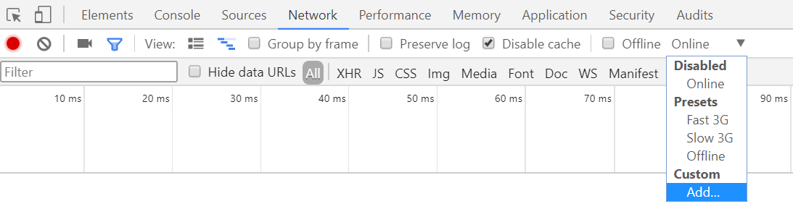
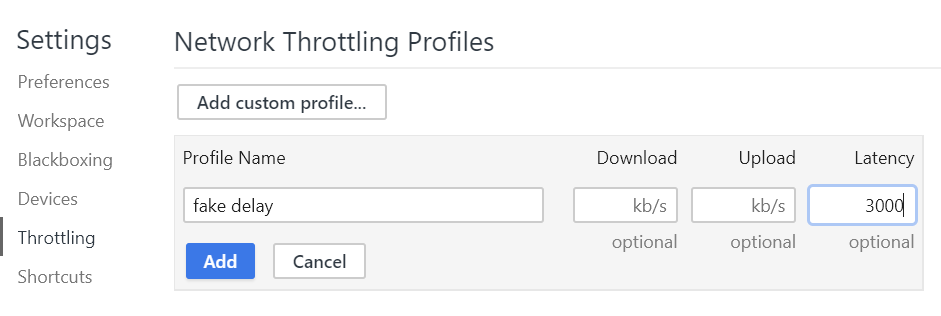

# Etape 4: Stratégie de Cache/Update/Refresh pour les requêtes GET de l'API REST

Nous avons vu à l'étape précédente comment mettre en cache des fichiers statiques. La stratégie que nous avons mis en place pour ces fichiers est dite *Cache-First*, c'est-à-dire qu'on servira toujours la version en cache en priorité. Qu'en est-il des données dynamiques, typiquement des réponses d'API ?

Pour les besoins du mode offline, il nous faut également mettre ces données dans un cache local. En revanche, contrairement aux fichiers statiques, il est important pour l'utilisateur de disposer des données les plus récentes (les plus "fraîches"), et ce le plus tôt possible. Il nous faut donc changer de stratégie.

## Cache, Update, Refresh

Cette stratégie de cache est légèrement plus complexe mais permet d'utiliser le cache local pour accélérer considérablement le temps de premier chargement, quitte à afficher temporairement des données non à jour.

Pour chaque requête, le service Worker va dans un premier temps retourner immédiatement une réponse en cache si elle existe, puis en parallèle requêter le réseau. A la réception de la réponse depuis le réseau, l'entrée en cache sera mise à jour et l'interface utilisateur sera mise à jour automatiquement.

Ce rafraichissement de l'interface peut se concrétiser de différentes manières selon les cas. On peut simplement ajouter dynamiquement des éléments à une liste, comme des messages dans une conversation instantanée par exemple. Ou alors notifier l'utilisateur d'une autre manière, par exemple avec un lien proposant de charger le nouveau contenu disponible.

Avantages:

- Chargement instantané si une réponse est en cache
- Peut aider à dynamiser l'expérience utilisateur

Inconvénients:

- L'utilisateur ne doit pas pouvoir être en mesure d'interagir avec des données en cours de rafraichissement
- Le rafraichissement de l'interface à la réception de la réponse réseau peut gêner l'utilisateur si l'UX n'est pas bien pensée

## Implémentation

Nous allons pour notre application implémenter cette stratégie de *Cache, Update, Refresh* pour le chargement de la liste des participants au workshop. Cette liste va probablement peu évoluer entre chaque chargement et la plupart des évolutions successives consisteront en un ajout de un ou plusieurs autres participants. Le rafraichissement à l'écran devrait donc être naturel pour l'utilisateur. Cette stratégie semble donc la plus adaptée dans le cas présent.

### Choix de la stratégie selon la requête

Repartons du code du Service Worker, dans le callback d'événement `fetch`. Nous allons distinguer les requêtes vers notre API des requêtes statiques, afin d'appliquer une stratégie différente pour les données:

```js
self.addEventListener('fetch', event => {
    if(event.request.url.includes("/api/")){
    	// réponse aux requêtes API, stratégie Cache Update Refresh
    } else {
        // réponse aux requêtes de fichiers statiques, stratégie Cache-First
    }    
})
```

Toutes nos requêtes vers l'API passent par le même endpoint contenant `/api/` dans l'URL. On peut donc facilement identifier ces requêtes en se basant sur l'URL accessible depuis `event.request.url`. Voici la [documentation de l'API FetchEvent](https://developer.mozilla.org/en-US/docs/Web/API/FetchEvent).

### 1. Cache

La première étape est de répondre immédiatement avec la réponse en cache si elle existe. Vous pouvez pour cela réutiliser le code de l'étape 3 pour la réponse aux requêtes de ressources statiques.

### 2. Update

En parallèle, la requête au réseau doit également être faite avec la méthode `fetch(request)`.

Vous pouvez tout à fait continuer à utiliser l'objet `event` dans la suite du code même après un premier `event.respondWith`. Cependant, vous devrez alors utiliser la méthode `event.waitUntil()` pour étendre la durée de vie de l'événement et indiquer au navigateur que d'autres tâches doivent être effectuées au delà de la réponse initiale.

```js
function update(request) {
	return fetch(request)
    .then(response => {
        if (!response.ok) {
            throw new Error('Network error');
        }
        
        // on peut mettre en cache la réponse            
        return response;
    })
}
```

La réponse réseau doit ensuite être mise dans le cache. Ouvrez le cache comme à l'étape précédente, puis ajoutez la réponse réseau avec la méthode `cache.put(request, response.clone())`. 

::: warning Attention
Une réponse ne peut être lue qu'une seule fois, elle doit donc être clonée avec la méthode `.clone()` avant de la stocker en cache.
:::

### 3. Refresh

Si le réseau a répondu et que la réponse a été mise en cache, on souhaite indiquer à l'application que de nouvelles données sont disponibles afin d'actualiser l'affichage.

La fonction `update` retourne une `Promise` de `Response`, vous pouvez donc la chaîner avec `.then()` pour exécuter une autre fonction à la suite d'une réponse réseau.

Les applications ayant un Service Worker inscrit et installé sont appelés "clients" au regard de ce Service Worker, et sont accessibles via [l'API `Clients` documentée ici](https://developer.mozilla.org/en-US/docs/Web/API/Clients)

```js
function refresh(response) {
	return response.json() // lit et parse la réponse JSON
	.then(newData => {
		self.clients.matchAll().then(clients => {
			clients.forEach(client => {
				// signaler et envoyer au client les nouvelles données
			})
		})
	})
}
```

Le Service Worker communique avec le client par le biais de la méthode `client.postMessage`. Le format d'échange est textuel, vous devrez donc sérialiser vos données en JSON comme ceci:

```js
client.postMessage(JSON.stringify({
    type: response.url,
    data: newData
}))
```

Le message devra être un objet constitué a minima d'une propriété pour identifier le type de message (l'URL de la requête correspondante par exemple) et d'une autre propriété contenant les données à transmettre (le contenu de la réponse).

## Rafraîchissement côté applicatif

Le client peut écouter les messages émis par le Service Worker via le callback `navigator.serviceWorker.onMessage`. Vous pouvez ensuite désérialiser le message avec `JSON.parse(event.data)`.

```js
navigator.serviceWorker.onMessage = event => {
	const message = JSON.parse(event.data);
	if(message.type && message.type.includes("/api/users")){
		console.log("Liste des participants à jour", message.data);
	}
}
```

Dans `scripts.js`, la fonction `renderAttendees` permet d'actualiser la liste des participants.

Complétez le code d'installation du Service Worker vu à l'étape 2 et 3 pour réagir à la réception d'un message du Service Worker. Si le message correspond à une mise à jour des participants, rappelez la fonction `renderAttendees` avec les données reçues dans le message.

## Test de bon fonctionnement

Pour tester le bon fonctionnement de la stratégie de chargement, nous allons simuler l'ajout de nouveaux participants. Le nombre de participants est déterminé par la variable `nbAttendees` dans `scripts.js`. Cette variable est transmise en paramètre à l'API de mockup.

Retirez le fichier `scripts.js` du precaching et assurez-vous que le Service Worker est bien actualisé et réinstallé (dans les Developer Tools, onglet Application > Service Workers, cochez la case *Update on reload*, voir étape 2). Puis allez sur l'onglet *Network* ajoutez une fausse latence réseau:





Enfin, changez la variable `nbAttendees` dans `scripts.js` et actualisez la page. Une latence de 3 secondes vous laissera le temps de voir le premier affichage (version cache) puis le rafraichissement et l'ajout des nouveaux participants à la réception des nouvelles données.
