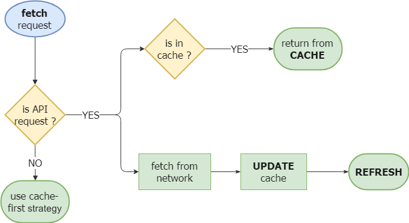

# Step 4: Cache / Update / Refresh strategy for GET requests from the REST API

We saw in the previous step how to cache static files. The strategy we have put in place for these files is called _Cache-First_, that is, always return the cached version if available. What about dynamic data, typically API responses?

To have an offline mode, we also need to put this data in a local cache. On the other hand, unlike static files, it is important for the user to have the most recent data (the "freshest") as soon as possible. So we have to change our strategy.

## Cache, Update, Refresh

This cache strategy is slightly more complex but allows the use of the local cache to significantly speed up the first loading time, even if temporarily displaying data that is out of date.

For each request, the Worker service will first immediately return a cached response if it exists, and then in parallel query the network. Upon receiving the response from the network, the cached entry will be updated and the user interface will be updated automatically.

Refreshing the interface can be done in different ways depending on your use case. You can simply add items dynamically to a list, like messages in an instant conversation for example. Or notify the user in another way, for example with a link proposing to load the new content available.



Advantages:

- Instant load if a response is cached
- Can improve the user experience

Disadvantages:

- The user must not be able to interact with out-to-date data
- Refreshing the interface after network response can disturb the user if UX is not well thought out

## Implementation

For our application, we will implement this _Cache, Update, Refresh_ strategy to load the list of workshop attendees. This list will probably change a little between each request and most of the successive changes will be the addition of a few attendees. Refreshing the view should therefore be quite natural for the user. This strategy seems to be the most appropriate in this case.

### Choosing the right strategy depending on the request

Let's start again with the Service Worker code in the `fetch` event callback. We will distinguish requests to our API from requests to static files, in order to apply a different strategy:

```js
self.addEventListener("fetch", (event) => {
  if (event.request.url.includes("/api/")) {
    // response to API requests, Cache Update Refresh strategy
  } else {
    // response to static files requests, Cache-First strategy
  }
});
```

All our requests to the API go through the same endpoint containing `/api/` in the URL. So, we can easily identify these requests based on the URL accessible from `event.request.url`. Here is the [FetchEvent API documentation](https://developer.mozilla.org/en-US/docs/Web/API/FetchEvent).

### 1. Cache

The first step is to respond immediately with the cached response if it exists. You can do this by reusing the `caches.match` function seen in step 3 to respons to static files requests.

<Solution />

```js
if (event.request.url.includes("/api/")) {
  // response to API requests, Cache Update Refresh strategy
  event.respondWith(caches.match(event.request));
  //TODO: update et refresh
}
```

### 2. Update

In parallel, the request to the network also has be made with the `fetch(request)` method, then we update the cache with the response via the `cache.put` method. Declare the `update` function below in the Service Worker code:

```js
function update(request) {
  return fetch(request.url).then(
    (response) =>
      cache(request, response) // we can put response in cache
        .then(() => response) // resolve promise with the Response object
  );
}
```

Then, call this `update` function in the`fetch` callback in parallel with the response with the cached version. You can still continue to use the `event` object in the following code even after a first `event.respondWith`. However, you will need to use the `event.waitUntil()` method to extend the life of the event and tell the browser that more work needs to be done beyond the initial response.

<Solution />

```js
if (event.request.url.includes("/api/")) {
  // response to API requests, Cache Update Refresh strategy
  event.respondWith(caches.match(event.request));
  event.waitUntil(update(event.request)); //TODO: refresh
}
```

### 3. Refresh

If the network has responded and the response has been cached, you want to tell the application that new data is available to refresh the application view.

Applications with a registered and installed Service Worker are referred to as "clients" for this Service Worker, and can be accessed through the [Clients API documented here](https://developer.mozilla.org/en-US/docs/web/API/Clients). The Service Worker communicates with the client through the `client.postMessage` method. The exchange format is textual, so you will need to serialize your data into JSON. The transmitted message will be an object composed with at least one property to identify the type of message (here we chose the URL of the corresponding request) and another property containing the data to be transmitted (the content of the response).

Declare the `refresh` function below in the Service Worker code.

```js
function refresh(response) {
  return response
    .json() // read and parse JSON response
    .then((jsonResponse) => {
      self.clients.matchAll().then((clients) => {
        clients.forEach((client) => {
          // report and send new data to client
          client.postMessage(
            JSON.stringify({
              type: response.url,
              data: jsonResponse.data,
            })
          );
        });
      });
      return jsonResponse.data; // resolve promise with new data
    });
}
```

All that remains is to assemble the 3 `cache`, `update` and `refresh` blocks to finalize the strategy: the cache response with `event.respondWith`, then in parallel the update followed by the refresh in a `event.waitUntil`. The `update` function returns a`Promise` resolved with the network response, so you can chain it with `.then()` to execute another function after the network response.

<Solution/>

```js
if (event.request.url.includes("/api/")) {
  // response to API requests, Cache Update Refresh strategy
  event.respondWith(caches.match(event.request));
  event.waitUntil(update(event.request).then(refresh));
}
```

## Refreshing the view

The client can listen to messages emitted by the Service Worker via the `navigator.serviceWorker.onmessage` callback. Then you can deserialize the message with `JSON.parse(event.data)`. In `scripts.js`, once the Service Worker is registered, declare the following callback:

```js
navigator.serviceWorker.onmessage = (event) => {
  const message = JSON.parse(event.data);
  //TODO: detect the type of message and refresh the view
};
```

The `renderAttendees` function allows you to update the list of attendees. The view will be updated when the Service Worker sends the message with the new data. Complete the code above, checking if the message is an update of the attendees list, then recall the `renderAttendees` function with the data received in the message.

<Solution />
```js
navigator.serviceWorker.onmessage = event => {
	const message = JSON.parse(event.data);
	if(message && message.type.includes("/api/users")){
		console.log("List of attendees to date", message.data)
		renderAttendees(message.data)
	}
}
```

## Testing

To test if the loading strategy works properly, since the application currently uses a mockup API with false data, we will simulate changes in the number of attendees and add a false network latency to give us the time to observe the strategy in action.

Change the `update` function in`sw.js` like this:

```js
const delay = ms => _ => new Promise(resolve => setTimeout(() => resolve(_), ms))

function update(request) {
	// mockup: load randomly between 1 and 10 attendees
	return fetch(request.url + `?per_page=${Math.ceil(Math.random() * 10)}`)
	.then(delay(3000)) // add a fake latency of 3 seconds
	.then(response => {
		(...)
```

Make sure the Service Worker is up-to-date and reinstalled (in the Developer Tools, Application> Service Workers tab, check the _Update on reload_ check box, see step 2), then reload the page. You should see the old number of attendees, then 3 seconds later the list will refresh with a new number of attendees.
