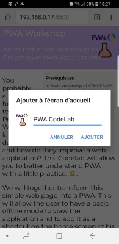
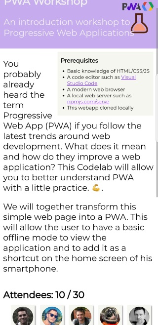
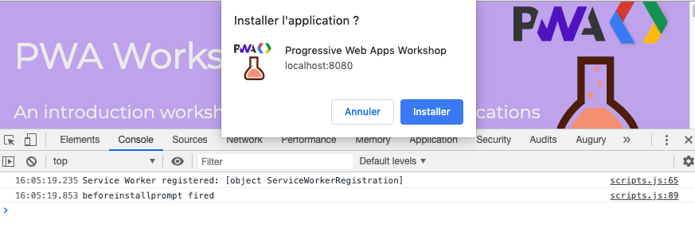
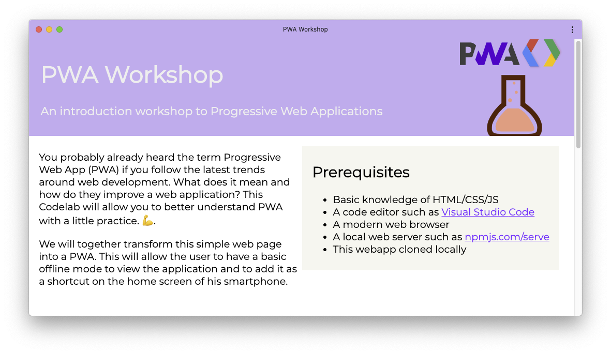

# Step 5 : Installing the PWA on the device

## Introduction

One of the advantages of PWA is that they can be installed if they respect certain criteria which depend on the browser. Here are the criteria for [Chrome](https://developers.google.com/web/fundamentals/app-install-banners/#criteria):

- The web app is not already installed.
  - and `prefer_related_applications` is not true.
- Meets a user engagement heuristic (currently, the user has interacted with the domain for at least 30 seconds)
- Includes a web app manifest that includes:
  - `short_name` or `name`
  - icons must include a 192px and a 512px sized icons
  - `start_url`
  - display must be one of: `fullscreen`, `standalone`, or `minimal-ui`
- Served over HTTPS (required for service workers)
- Has registered a service worker with a fetch event handler

Originally, the browser handled all the steps related to installation from the presentation of the banner to the addition of the app icon to the homescreen. However, it is now possible for the app to handle the presentation of the UI that leads to the PWA install prompt. In this case, the browser manages whether we should display that button and the presentation of the prompt. The app should verify if it can present a setup UI by listening to the and ask the browser to show the popup of the user requests it.

## Installing the PWA

Depending on the browser and OS, the technical requirements to install the PWA on the system may vary. But in theory, if you have a manifest and an active Service Worker handling incoming requests with `fetch`, then you should be able to install that PWA on all supported platforms, and they will leverage the manifest and Service Worker.

The platform with the best support today is **Android**. If you have an Android smartphone that can connect to your server by sharing a local connection, then try to load the app through Chrome for Android. Once the web page is open, the Chrome menu should include the option: **Add to home screen**


Continue the installation. A new shortcut should appear in your phone home screen. This is the shortcut to our PWA!




Once the PWA is installed, when you click on the shortcut, a splash screen is displayed briefly. It uses the colors and icons specified in the web app manifest.

You will also notice that the URL bar and the rest of the browser UI are no longer shown if you have set the `display` property to `standalone` in the manifest.



## Add an installation button

Let's add an **install button** to our PWA by following these steps:

- Set the property [prefer_related_applications](https://developers.google.com/web/fundamentals/app-install-banners/native#prefer_related_applications) to `false` in the manifest file.

```json
{
  "prefer_related_applications": false
}
```

- Add a button somewhere in your page and hide it by default

```html
<button id="setup_button" onclick="installApp()">Installer</button>
```

```css
#setup_button {
  display: none;
}
```

- In the main JavaScript file, intercept the `beforeinstallprompt` event which is fired when the PWA meets to install criteria. In this event event handler, we need to keep a reference to the event and show the setup button.

```js
let deferredPrompt; // Allows to show the install prompt
let setupButton;

window.addEventListener("beforeinstallprompt", e => {
  // Prevent Chrome 67 and earlier from automatically showing the prompt
  e.preventDefault();
  // Stash the event so it can be triggered later.
  deferredPrompt = e;
  console.log("beforeinstallprompt fired");
  if (setupButton == undefined) {
    setupButton = document.getElementById("setup_button");
  }
  // Show the setup button
  setupButton.style.display = "inline";
  setupButton.disabled = false;
});
```

- In the `installApp()` function, show the setup prompt.

```js
function installApp() {
  // Show the prompt
  deferredPrompt.prompt();
  setupButton.disabled = true;
  // Wait for the user to respond to the prompt
  deferredPrompt.userChoice.then(choiceResult => {
    if (choiceResult.outcome === "accepted") {
      console.log("PWA setup accepted");
      // hide our user interface that shows our A2HS button
      setupButton.style.display = "none";
    } else {
      console.log("PWA setup rejected");
    }
    deferredPrompt = null;
  });
}
```

- Optionally, we can listen for the app installed event to perform any additional setup when the install finished

```js
window.addEventListener("appinstalled", evt => {
  console.log("appinstalled fired", evt);
});
```

Now's the time to test. Don't hesitate to reload the page by clearing the cache. In macOS, the shortcut is **⇧⌘R**




Here is how an installed PWA looks on macOS


