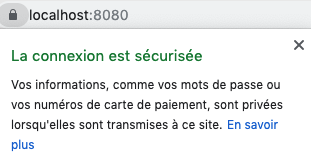

# Workshop: Turning a web app into a PWA


<SuggestLocale></SuggestLocale>

You may have heard about Progressive Web Apps (PWA) in the latest web trends. What is it all about and how do they improve classic web applications ? This workshop will let you understand PWA better with a bit of practice 💪.

We will transform together a classic web application into a PWA. This will enable the user to have a basic offline mode, and to install the app on his smartphone with a shortcut on the homescreen.

## Requirements

- Basic knowledge of HTML, CSS and JavaScript. Understanding Promises and asynchronicity in JS can be a plus.
- A computer with a **code editor** such as [Visual Studio Code](https://code.visualstudio.com/)
- **Google Chrome** (_PWA are supported on most browsers but to facilitate the organization of the workshop, we will all use the same browser during development_)
- A **local web server** (if you don't have any, try [npmjs.com/http-server](http://npmjs.com/http-server) with `cd app && http-server`)

## Preparation

- [Clone or download the example web app](https://github.com/sylvainpolletvillard/pwa-workshop.git) which is located in the [app folder](https://github.com/sylvainpolletvillard/pwa-workshop/tree/master/app) of this repo.
- Open the `app` folder in your code editor.
- Configure your local server to serve the `app` folder with HTTPS (see instructions below).
- Load the `app/index.html` page on Google Chrome. A list of attendees should be displayed.

## Local development with SSL

PWA require the use of HTTPS. This not a big matter for a deployed PWA because most web hosts provide HTTPS out of the box. However, it is not the case for local development. In fact, it requires manually generating and installing certificates to the certificate store. Fortunately, there is a cool CLI tool called [mkcert](https://mkcert.dev/) that simplifies these steps.

Let's setup our local HTTPS server by following these steps:

- Install [mkcert](https://github.com/FiloSottile/mkcert#installation) as indicated in its GitHub page
- Run `mkcert -install` to install a local CA (Certification authority)

```console
Created a new local CA at "/Users/****/Library/Application Support/mkcert" 💥
The local CA is now installed in the system trust store! ⚡️
The local CA is now installed in the Firefox trust store (requires browser restart)! 🦊
```

- cd to the website root
- Run this command that generated certificated for our server: `mkcert localhost 127.0.0.1 ::1`

```console
Using the local CA at "/Users/****yassinebenabbas****/Library/Application Support/mkcert" ✨

Created a new certificate valid for the following names 📜
 - "localhost"
 - "127.0.0.1"
 - "::1"

The certificate is at "./localhost+2.pem" and the key at "./localhost+2-key.pem" ✅
```

- We will get two pem files. These will be used by our SSL enabled dev server.


- Install npm package `http-server` if not done already with : `npm i -g http-server`
- Run the server in SSL mode: `http-server -S -o -C "localhost+2.pem" -K "localhost+2-key.pem"`



In this part, we saw how to install a Service Worker, and how to manage two Service Worker lifecycle events: **install** and **activate**. Now, let's see how to do something useful with this Service Worker.

## Steps of the workshop

1. Add a web application manifest
2. Install and activate a Service Worker
3. Pre-caching of static assets for a basic offline mode
4. Cache/Update/Refresh Strategy for the API GET requests
5. Background sync and examples of push notifications
6. Presenting an install button
